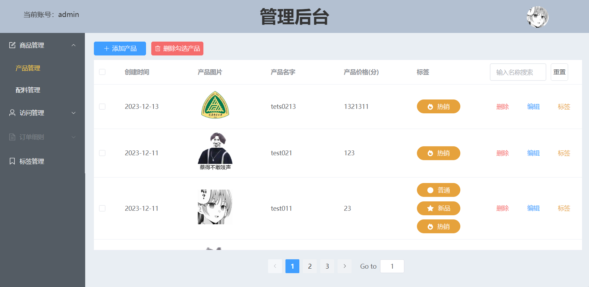
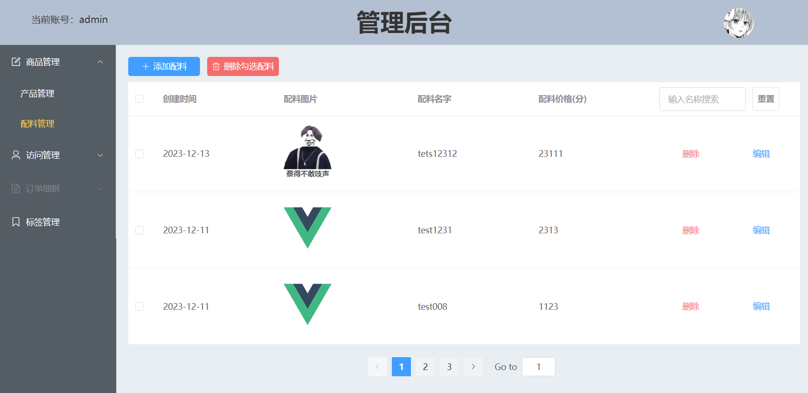
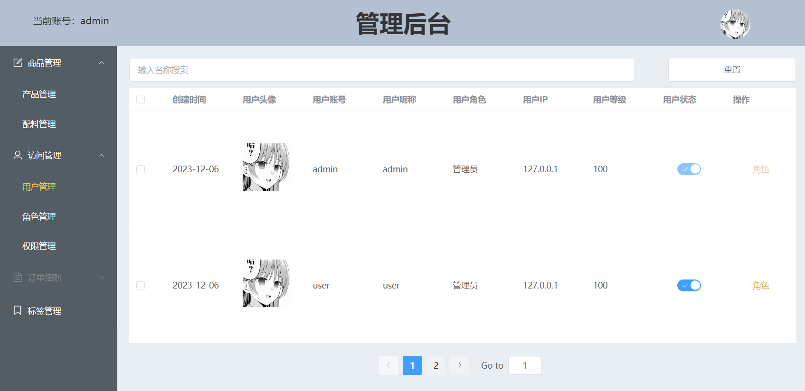
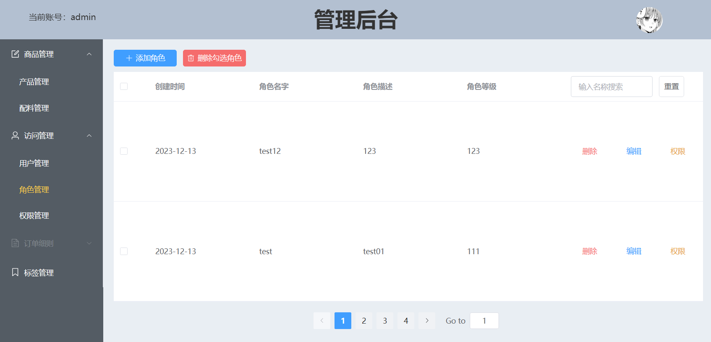
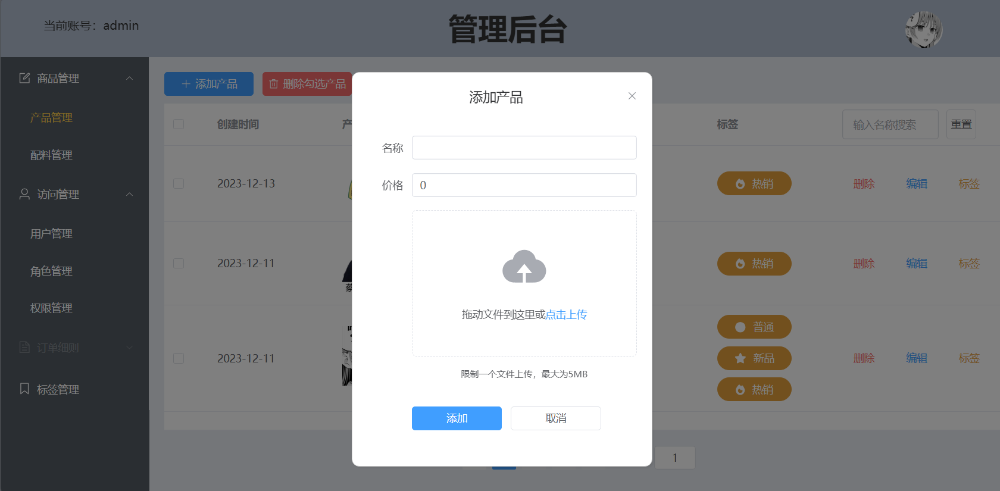

# Cake-admin

Cake-admin系统后端，一个简单的权限和商品管理系统。有商品管理，权限功能，角色管理以及oss管理功能

[![Contributors][contributors-shield]][contributors-url]
[![Forks][forks-shield]][forks-url]
[![Stargazers][stars-shield]][stars-url]
[![Issues][issues-shield]][issues-url]

<!-- PROJECT LOGO -->
 

  

<h3 align="center">cake-admin-project</h3>
  

    cake-admin-project后端系统
     
    <a href="https://github.com/Cookici/cake-admin-project"><strong>cake-admin-project前端项目文档 »</strong></a>
     
     
    <a href="https://github.com/Cookici/cake-admin-project">查看Demo</a>
    ·
    <a href="https://github.com/Cookici/cake-admin-project/issues">报告Bug</a>
    ·
    <a href="https://github.com/Cookici/cake-admin-project/issues">提出新特性</a>
  

本篇README.md面向开发者

  

## 目录

- [上手指南](#上手指南)
    - [开发前的配置要求](#开发前的配置要求)
    - [部署步骤](#部署步骤)
- [开发的架构](#开发的架构)
- [使用到的框架](#使用到的框架)
- [贡献者](#贡献者)
    - [如何参与开源项目](#如何参与开源项目)
- [版本控制](#版本控制)
- [作者](#作者)
- [项目参考以及鸣谢](#项目参考以及鸣谢)
- [cake-admin-project后端项目](#cake-admin-project后端项目)
- [项目展示](#项目展示)

  

### 上手指南
    需要一定的硬件配置以及编程基础

###### 开发前的环境配置
1. JAVA JDK8
2. IDEA
3. Maven

###### **搭建步骤**
1. 搭建mysql
2. 配置阿里云oss

  

### 开发的架构
Vue3+Vite+TypeScript

  

### 使用到的框架
- SpringBoot 2.6.13
- SpringSecurity
- MySQL 8.0.30
- MyBatis-Plus 3.5.0

  

### 贡献者
我与摆子

  

#### 如何参与开源项目
贡献使开源社区成为一个学习、激励和创造的绝佳场所。你所作的任何贡献都是**非常感谢**的。

  

### 版本控制
该项目使用Git进行版本管理。您可以在repository参看当前可用版本。

  

### 作者
✉️632832232@qq.com
🐧632832232

  

### 项目参考以及鸣谢
- 本项目中使用到的各种开源组件及框架的开发者们
- 本项目中参考开源社区的各位前辈的解决方案以及代码实现

  

### cake-admin-vue3-project前端项目
<a href="https://github.com/Cookici/cake-admin-vue3-project/tree/main">cake-admin-vue3-project</a>

  

### 项目展示

<!-- links -->

[your-project-path]: https://github.com/Cookici/cake-admin-project/tree/main

[contributors-shield]: https://img.shields.io/github/contributors/Cookici/cake-admin-project.svg?style=flat-square

[contributors-url]: https://github.com/Cookici/cake-admin-project/graphs/contributors

[forks-shield]: https://img.shields.io/github/forks/Cookici/cake-admin-project.svg?style=flat-square

[forks-url]: https://github.com/Cookici/cake-admin-project/network/members

[stars-shield]: https://img.shields.io/github/stars/Cookici/cake-admin-project.svg?style=flat-square

[stars-url]: https://github.com/Cookici/cake-admin-project/stargazers

[issues-shield]: https://img.shields.io/github/issues/Cookici/cake-admin-project.svg?style=flat-square

[issues-url]: https://img.shields.io/github/issues/Cookici/cake-admin-project.svg

[license-shield]: https://img.shields.io/github/license/Cookici/cake-admin-project.svg?style=flat-square
